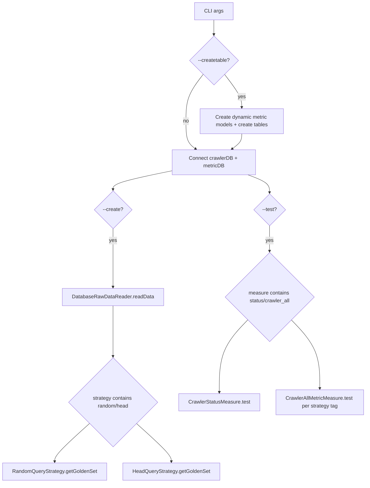

# measure.py - Full Technical Document

## 1. Scope and Role

`measure.py` is the main orchestrator for:

- Creating metric tables.
- Generating golden datasets from trending keyword sources.
- Executing measurement jobs (crawler status and coverage metrics).

It coordinates three layers:

- Data source ingestion (`Metric.RawDataReader`).
- Golden set generation (`Metric.Query`).
- Metric computation and persistence (`Metric.Measure`).

## 2. CLI Contract

`measure.py` exposes the following arguments:

- `--strategy [random|head]...`: Which golden-set strategy(ies) to run.
- `--crawler_db_url`: Host:port for crawler PostgreSQL.
- `--metric_db_url`: Host:port for metric PostgreSQL.
- `--create`: Build/update golden sets.
- `--rawdatareader db`: Read trending raw data via DB-backed reader.
- `--update <days>`: Raw-data cache TTL in days (default: 14).
- `--keywordNums <N>`: Number of keywords for strategy (default: 100).
- `--test`: Execute measure phase.
- `--typesense_url`: Reserved/not actively used by current active measures.
- `--measure [status|rank|crawler_all|all]...`: Which measure(s) to execute.
- `--createtable`: Create metric tables before execution.

## 3. Runtime Modes

### 3.1 Table creation mode

- If `--createtable` is set:
  - Calls `createAllMetricModel()` to register dynamic ORM models:
    - `crawler_stat_total`, `crawler_stat_a`, `crawler_stat_b`
    - `metric_headset_total`, `metric_headset_a`, `metric_headset_b`
    - `metric_randomset_total`, `metric_randomset_a`, `metric_randomset_b`
  - Calls `createDB(..., createTable=True, base=MetricBase)` for metric DB.

### 3.2 Dataset creation mode (`--create`)

Flow:

1. Build `DatabaseRawDataReader(metricDB, modelFactory, update_day)`.
2. `readData()` returns trending keywords:
   - Uses latest cached `metric_batches` entry if fresh.
   - Otherwise fetches from SerpApi and persists new batch/query rows.
3. Read latest batch id via `get_latest_batch_id()`.
4. For each strategy:
   - `random`: sample `keywordNums` keywords.
   - `head`: pick top `keywordNums` by frequency.
5. For each chosen keyword:
   - Query Google organic results via SerpApi.
   - Upsert `metric_queries.tags` with strategy tag.
   - Replace associated rows in `metric_url`.
6. Recompute batch metadata (`meta_total_queries`, `meta_total_urls`, `meta_tag_stats`).

### 3.3 Measure execution mode (`--test`)

- `status`: runs `CrawlerStatusMeasure`.
- `crawler_all`: for each selected strategy tag (`head`/`random`), runs `CrawlerAllMetricMeasure`.
- `rank`: currently no-op in active implementation.

## 4. DB Initialization

`createDB(user, password, url, name)` composes:

- `postgresql+psycopg2://{user}:{password}@{url}/{name}`

Effective defaults from `measure.py`:

- Crawler DB credentials: `crawler:crawler`, DB name `crawlerdb`.
- Metric DB credentials: `metric:metric`, DB name `metricdb`.

## 5. Key Internal Functions

### 5.1 `get_latest_batch_id`

- SQLAlchemy `select(MetricBatch.id).order_by(id desc).limit(1)`.
- Returns latest batch id or `None`.
- Used by dataset generation and coverage measuring.

### 5.2 `createDataset`

Responsibilities:

- Read or refresh raw trending keyword data.
- Run one or more golden-set strategies.
- Persist/refresh query->URL mapping in metric DB.

### 5.3 `test`

Responsibilities:

- Run measurement classes against crawler + metric DB.
- Persist computed KPI tables via UPSERT.

## 6. Control Flow Diagram

## 7. Operational Notes

- `rank` pathway is not active; do not assume search ranking KPIs are written.
- `indexed` currently remains `0` in status/coverage flows because index-status source is not wired.
- `--measure all` appears in choices but no explicit branch handles it in current code.

