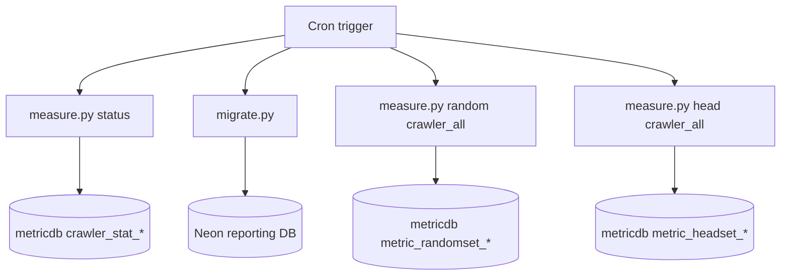

# Dockerfile and Runtime Operations - Full Technical Document

## 1. Container Build Design

Base image:

- `ubuntu:24.04`

Installed packages:

- `git`, `python3`, `python3-pip`, `python3-venv`, `cron`, `vim`

Project layout in container:

- Code copied to `/root/WebSearchEngine`
- Virtualenv at `/root/system-venv`
- Dependencies installed from `/root/WebSearchEngine/Metric/requirments.txt`

## 2. Runtime Environment

- `SERPAPI_KEY` is expected as environment variable.
- Dockerfile currently includes placeholder default value and exports into `/etc/environment` for cron visibility.

## 3. Scheduled Jobs (Cron)

Configured in `/etc/cron.d/search-engine-cron`:

- Hourly at minute 0:
  - `measure.py --test --measure status`
  - `migrate.py`

- Monthly on day 1 and 16 at 12:00:
  - `measure.py --create --strategy random --keywordNums 1000 --test --measure crawler_all`

- Monthly on day 1 and 16 at 18:00:
  - `measure.py --create --strategy head --keywordNums 1000 --test --measure crawler_all`

All cron outputs append to `/var/log/cron.log`.

## 4. Runtime Process Model

Container command:

- `CMD cron && tail -f /var/log/cron.log`

This keeps cron daemon active and container alive via log tailing.

## 5. Supporting Compose Service

`docker-compose.yml` defines `metric_postgres`:

- Image: `postgres:16`
- User/password/db: `metric/metric/metricdb`
- Port mapping: `5433:5432`
- Data volume: `/data/metric:/var/lib/postgresql/data`

## 6. Operations Diagram

