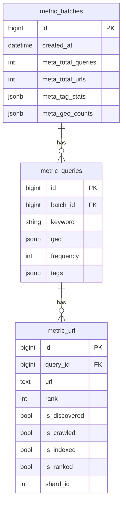

# Database Schema Design - Full Technical Document

## 1. Schema Domains

The system uses two logical data domains:

- Crawler domain (`crawlerdb`): crawl state and daily crawl summaries.
- Metric domain (`metricdb`): golden datasets, URL-level labels, and KPI rollups.

## 2. Crawler Domain Tables (Read by Metrics)

### 2.1 `url_state_current_###` (dynamic shard tables, 256 shards)

Generated via `UrlStateCurrentMixin` + suffix `000..255`.

Core columns used by measurement:

- `url` (PK)
- `domain_id`
- `last_fetch_ok` (nullable timestamp; non-null => crawled)

Additional signals exist (scores, fail counters, hash fields), but not used directly in current metric aggregation.

### 2.2 `domain_state`

- `domain_id` (PK)
- `domain` (unique)
- `shard_id`
- `domain_score`

Used to map domain -> shard/team when URL is not directly found.

### 2.3 `summary_daily`

- `event_date` (PK)
- `num_fetch_ok`
- `num_fetch_fail`
- `fail_reasons` JSONB
- additional error counters

Used by `CrawlerStatusMeasure` for daily/7-day/30-day flow KPIs.

## 3. Metric Domain Core Tables

### 3.1 `metric_batches`

- `id` (PK)
- `created_at`
- `meta_total_queries`
- `meta_total_urls`
- `meta_tag_stats` JSONB
- `meta_geo_counts` JSONB

Represents one raw-trending ingestion batch and its derived metadata.

### 3.2 `metric_queries`

- `id` (PK)
- `batch_id` (FK -> `metric_batches.id`)
- `keyword`
- `geo` JSONB array
- `frequency`
- `tags` JSONB array
- GIN index on `tags` (`ix_metric_queries_tags`)

Represents keyword-level dataset units.

### 3.3 `metric_url`

- `id` (PK)
- `query_id` (FK -> `metric_queries.id`)
- `url`
- `rank`
- `is_discovered`
- `is_crawled`
- `is_indexed`
- `is_ranked`
- `shard_id`

Represents URL-level golden entries and measurement labels.

## 4. Metric Rollup Tables (Dynamic)

### 4.1 Crawler status rollups

- `crawler_stat_total`
- `crawler_stat_a`
- `crawler_stat_b`

Shared schema from `CrawlerStatMixin`:

- snapshot: `discovered`, `crawled`, `indexed`
- daily flow: `fetch_ok`, `fetch_fail`, `fetch_total`
- rolling windows: `*_7`, `*_30`
- HTTP errors: 404 and 500 for 1/7/30 day windows

PK: `stat_date`.

### 4.2 Coverage rollups

- `metric_headset_total|a|b`
- `metric_randomset_total|a|b`

Shared schema from `MetricCoverageMixin`:

- `total`
- `discovered_num`, `discovered_rate`
- `crawled_num`, `crawled_rate`
- `indexed_num`, `indexed_rate`
- `ranked_num`, `ranked_rate`

PK: `stat_date`.

## 5. Team Partition Definition

- Team A: shard id `0..127`
- Team B: shard id `128..255`

This partition is used in both status and coverage aggregations.

## 6. ER Diagram (Metric Domain)

