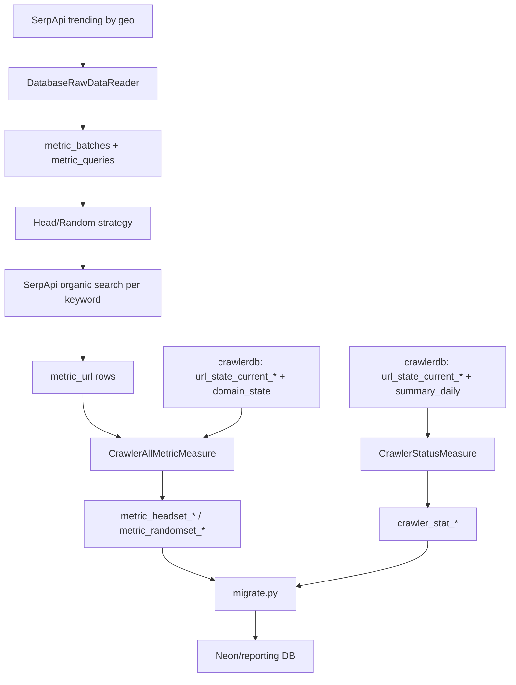

# Metric Pipeline, Query Logic, and URL Sources - Full Technical Document

## 1. End-to-End Data Flow



## 2. Architecture Design

### 2.1 Layered components

- Orchestration layer: `measure.py`, `migrate.py`, cron schedules.
- Data access layer: `Database.Database`, SQLAlchemy ORM models.
- Data ingestion layer: `DatabaseRawDataReader` (cache + API fallback).
- Dataset generation layer: `HeadQueryStrategy`, `RandomQueryStrategy`.
- Measurement layer: `CrawlerStatusMeasure`, `CrawlerAllMetricMeasure`.
- Reporting export layer: pandas-based table replication (`migrate.py`).

### 2.2 Reliability characteristics

- Session context manager with rollback on exceptions.
- Per-keyword commit in strategy generation (limits transaction blast radius).
- Per-table isolation in migration loop.
- API retry logic with exponential backoff in keyword search.

## 3. Metric Query Logic (SQL-equivalent)

Below are representative SQL equivalents of ORM operations.

### 3.1 Latest batch lookup

```sql
SELECT id
FROM metric_batches
ORDER BY id DESC
LIMIT 1;
```

### 3.2 Cached batch retrieval (raw data reuse)

```sql
SELECT *
FROM metric_batches
ORDER BY created_at DESC
LIMIT 1;
```

If batch age < `update_day`, load:

```sql
SELECT keyword, frequency, geo
FROM metric_queries
WHERE batch_id = :batch_id;
```

### 3.3 Golden URL retrieval by strategy tag

```sql
SELECT mu.*
FROM metric_url mu
JOIN metric_queries mq ON mq.id = mu.query_id
WHERE mq.batch_id = :batch_id
  AND mq.tags @> '["head"]'::jsonb; -- or random
```

### 3.4 Batch metadata recomputation

```sql
SELECT COUNT(*)
FROM metric_queries
WHERE batch_id = :batch_id;

SELECT COUNT(*)
FROM metric_url mu
JOIN metric_queries mq ON mq.id = mu.query_id
WHERE mq.batch_id = :batch_id;
```

### 3.5 Status snapshot per shard

For each `url_state_current_###` table:

```sql
SELECT
  COUNT(*) AS discovered,
  COUNT(*) FILTER (WHERE last_fetch_ok IS NOT NULL) AS crawled
FROM url_state_current_###;
```

### 3.6 Daily + rolling flow from `summary_daily`

For date range `[today-29, today]`, compute in application loop:

- daily (`delta=0`): `fetch_ok`, `fetch_fail`, `fetch_total`
- 7-day (`delta<7`): sums of fetch and HTTP 404/500
- 30-day (`delta<30`): sums of fetch and HTTP 404/500

### 3.7 Coverage formulas

For each group `G in {Total, A, B}`:

- `total_G = count(url in group)`
- `discovered_rate_G = discovered_num_G / total_G`
- `crawled_rate_G = crawled_num_G / total_G`
- `indexed_rate_G = indexed_num_G / total_G`

`ranked_*` currently hardcoded to zero in current implementation.

## 4. UPSERT Write Patterns

Status and coverage tables use PostgreSQL upsert semantics:

```sql
INSERT INTO <target_table>(stat_date, ...)
VALUES (:stat_date, ...)
ON CONFLICT (stat_date)
DO UPDATE SET ...;
```

This ensures idempotent daily reruns.

## 5. URL Sources and External Endpoints

### 5.1 SerpApi endpoints

- Trending source (`DatabaseRawDataReader._fetch_trending_now`):
  - Engine: `google_trends_trending_now`
  - Parameters include `geo`, `hours=168`, `api_key`.

- Organic results (`QueryStrategy.getQuery`):
  - Engine: `google`
  - Parameters include `q`, `num`, `api_key`.

- Quota endpoint (`Metric/getQuota.py`):
  - `https://serpapi.com/account.json`

### 5.2 Internal database URLs

- Metric DB URL template:
  - `postgresql+psycopg2://metric:metric@<metric_db_url>/metricdb`
- Crawler DB URL template:
  - `postgresql+psycopg2://crawler:crawler@<crawler_db_url>/crawlerdb`

Cron defaults in Dockerfile currently use:

- `--metric_db_url 172.16.191.1:5433`
- `--crawler_db_url 172.16.191.1:5432`

### 5.3 Migration target URL

`migrate.py` writes to Neon PostgreSQL URL with SSL requirement.

## 6. Important Current Limitations

- Index-related measurements are intentionally out of scope here.
- `SearchEngineAllMetricMeasure` and `TypesenseRankMeasure` are stubs in active code.
- `--measure all` has no explicit branch in `measure.py`.

